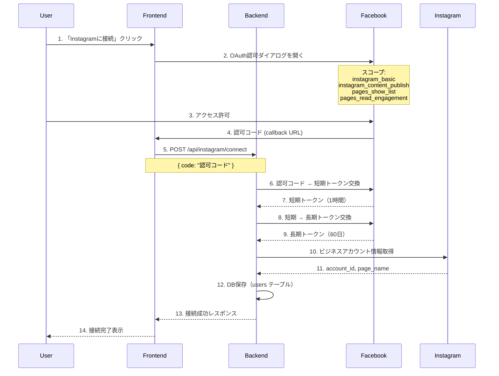
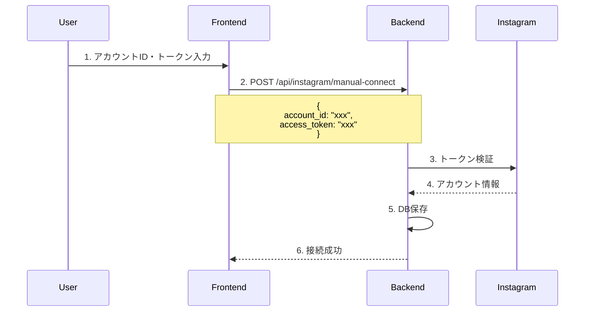

# Instagram連携・自動投稿機能 完全仕様書

## 目次
1. [概要](#概要)
2. [システムアーキテクチャ](#システムアーキテクチャ)
3. [認証フロー](#認証フロー)
4. [API仕様](#api仕様)
5. [データベース設計](#データベース設計)
6. [Celeryタスク](#celeryタスク)
7. [フロントエンド実装](#フロントエンド実装)
8. [エラーハンドリング](#エラーハンドリング)
9. [環境変数設定](#環境変数設定)
10. [トラブルシューティング](#トラブルシューティング)

---

## 概要

### システムの目的
Instagram Graph APIを使用して、生成した動画をInstagram Business/Creatorアカウントに自動投稿するシステムです。

### 主な機能
- ✅ Facebook OAuth認証によるInstagram Business接続
- ✅ 手動トークン入力による接続（開発用）
- ✅ 即時投稿
- ✅ スケジュール投稿（指定日時に自動投稿）
- ✅ トークン自動リフレッシュ（60日間有効）
- ✅ 投稿履歴・ステータス管理
- ✅ インサイト取得

### 使用API
- **Instagram Graph API v18.0**
- **Facebook Graph API**（認証用）

---

## システムアーキテクチャ

### 全体構成図

```
┌─────────────────────────────────────────────────────────────────┐
│                        Frontend (Next.js)                        │
│                         Port 3003                                │
│  ┌──────────────────┐  ┌──────────────────┐  ┌───────────────┐  │
│  │  Instagram連携   │  │   投稿フォーム   │  │  投稿履歴    │  │
│  │     ページ       │  │                  │  │              │  │
│  └────────┬─────────┘  └────────┬─────────┘  └──────┬────────┘  │
└───────────┼──────────────────────┼───────────────────┼──────────┘
            │                      │                   │
            ↓                      ↓                   ↓
┌─────────────────────────────────────────────────────────────────┐
│                      Backend (FastAPI)                           │
│                        Port 8000                                 │
│  ┌──────────────────────────────────────────────────────────┐   │
│  │                /api/instagram/* エンドポイント            │   │
│  │  - /connect       - /post         - /schedule            │   │
│  │  - /disconnect    - /posts        - /refresh-token       │   │
│  │  - /account       - /media        - /insights            │   │
│  └──────────────────────────────────────────────────────────┘   │
└─────────────────────────────┬───────────────────────────────────┘
                              │
         ┌────────────────────┼────────────────────┐
         ↓                    ↓                    ↓
┌─────────────────┐  ┌─────────────────┐  ┌─────────────────┐
│  Celery Worker  │  │   PostgreSQL    │  │  Cloudflare R2  │
│                 │  │   (Supabase)    │  │   (Storage)     │
│  - 投稿タスク   │  │                 │  │                 │
│  - スケジュール │  │  - users        │  │  - 動画保存     │
│  - トークン更新 │  │  - videos       │  │  - 公開URL      │
│                 │  │  - instagram_   │  │                 │
└────────┬────────┘  │    posts        │  └─────────────────┘
         │           └─────────────────┘
         ↓
┌─────────────────┐
│  Celery Beat    │
│  (Scheduler)    │
│                 │
│  - 1分毎:       │
│    スケジュール │
│    投稿チェック │
│                 │
│  - 毎日3時:     │
│    トークン更新 │
└─────────────────┘
         │
         ↓
┌─────────────────────────────────────────┐
│         Instagram Graph API              │
│         (api.instagram.com)              │
│                                          │
│  - メディアコンテナ作成                  │
│  - メディア公開                          │
│  - インサイト取得                        │
└─────────────────────────────────────────┘
```

### ファイル構成

```
backend/
├── app/
│   ├── routers/
│   │   └── instagram.py          # APIエンドポイント（全801行）
│   ├── tasks/
│   │   └── instagram_tasks.py    # Celeryタスク（全649行）
│   ├── core/
│   │   └── instagram_service.py  # Instagram APIラッパー（全512行）
│   ├── models/
│   │   ├── user.py               # ユーザーモデル（Instagram連携情報）
│   │   └── instagram_post.py     # 投稿モデル
│   └── utils/
│       └── instagram_errors.py   # エラーハンドリング（全306行）

frontend/
├── app/
│   ├── (dashboard)/
│   │   └── instagram/
│   │       └── page.tsx          # Instagram管理ページ
│   └── instagram/
│       └── callback/
│           └── page.tsx          # OAuth コールバック
```

---

## 認証フロー

### OAuth認証フロー（推奨）



### 手動接続フロー（開発用）



### トークンライフサイクル

```
┌────────────────────────────────────────────────────────────────┐
│                    トークンの種類と有効期限                      │
├────────────────────────────────────────────────────────────────┤
│                                                                │
│  短期トークン ──→ 長期トークン ──→ リフレッシュ後トークン      │
│    (1時間)         (60日)           (60日)                     │
│                                                                │
│  ┌─────────┐      ┌─────────┐      ┌─────────┐                │
│  │ 認可    │      │ 初回    │      │ 自動    │                │
│  │ コード  │ ───→ │ 交換    │ ───→ │ 更新    │ ───→ ...      │
│  │ 取得    │      │         │      │ (7日前) │                │
│  └─────────┘      └─────────┘      └─────────┘                │
│                                                                │
│  Celery Beat: 毎日午前3時にトークン有効期限をチェック          │
│  - 残り7日以内 → 自動リフレッシュ                              │
│  - リフレッシュ失敗 → ログ記録、ユーザーに通知                 │
│                                                                │
└────────────────────────────────────────────────────────────────┘
```

---

## API仕様

### 認証関連エンドポイント

#### 1. Instagram接続（OAuth）
```http
POST /api/instagram/connect
Authorization: Bearer {JWT_TOKEN}
Content-Type: application/json

Request:
{
  "code": "FACEBOOK_AUTHORIZATION_CODE"
}

Response 200:
{
  "success": true,
  "instagram_account_id": "17841400000000000",
  "page_name": "My Business Page",
  "connected_at": "2025-12-12T06:00:00Z",
  "token_expires_at": "2026-02-10T06:00:00Z"
}
```

**ファイル**: `backend/app/routers/instagram.py` (行79-142)

#### 2. 手動接続（開発用）
```http
POST /api/instagram/manual-connect
Authorization: Bearer {JWT_TOKEN}
Content-Type: application/json

Request:
{
  "account_id": "17841400000000000",
  "access_token": "IGQVJ..."
}

Response 200:
{
  "success": true,
  "instagram_account_id": "17841400000000000",
  "message": "Instagram account connected successfully"
}
```

**ファイル**: `backend/app/routers/instagram.py` (行35-76)

#### 3. アカウント情報取得
```http
GET /api/instagram/account
Authorization: Bearer {JWT_TOKEN}

Response 200:
{
  "connected": true,
  "instagram_account_id": "17841400000000000",
  "page_name": "My Business Page",
  "connected_at": "2025-12-12T06:00:00Z",
  "token_expires_at": "2026-02-10T06:00:00Z",
  "days_until_expiry": 58
}
```

**ファイル**: `backend/app/routers/instagram.py` (行145-172)

#### 4. 接続解除
```http
POST /api/instagram/disconnect
Authorization: Bearer {JWT_TOKEN}

Response 200:
{
  "success": true,
  "message": "Instagram account disconnected"
}
```

**ファイル**: `backend/app/routers/instagram.py` (行175-198)

#### 5. トークンリフレッシュ
```http
POST /api/instagram/refresh-token
Authorization: Bearer {JWT_TOKEN}

Response 200:
{
  "success": true,
  "new_expires_at": "2026-02-10T06:00:00Z",
  "message": "Token refreshed successfully"
}
```

**ファイル**: `backend/app/routers/instagram.py` (行460-497)

---

### 投稿関連エンドポイント

#### 6. 即時投稿
```http
POST /api/instagram/post
Authorization: Bearer {JWT_TOKEN}
Content-Type: application/json

Request:
{
  "video_id": 49,
  "caption": "Check out this video! #instagram #reels",
  "share_to_feed": true,
  "location_id": "123456789"  // オプション
}

Response 200:
{
  "success": true,
  "post_id": 123,
  "task_id": "uuid",
  "status": "processing",
  "message": "投稿処理を開始しました"
}
```

**ファイル**: `backend/app/routers/instagram.py` (行201-282)

#### 7. スケジュール投稿
```http
POST /api/instagram/schedule
Authorization: Bearer {JWT_TOKEN}
Content-Type: application/json

Request:
{
  "video_id": 49,
  "scheduled_time": "2025-12-15T18:00:00+09:00",
  "caption": "Scheduled post! #instagram",
  "share_to_feed": true
}

Response 200:
{
  "success": true,
  "post_id": 124,
  "scheduled_time": "2025-12-15T18:00:00+09:00",
  "message": "投稿がスケジュールされました"
}
```

**ファイル**: `backend/app/routers/instagram.py` (行285-382)

#### 8. 投稿履歴取得
```http
GET /api/instagram/posts
Authorization: Bearer {JWT_TOKEN}

Response 200:
{
  "posts": [
    {
      "id": 123,
      "video_id": 49,
      "status": "completed",  // scheduled, posting, processing, completed, failed
      "instagram_post_id": "17841400000000001",
      "permalink": "https://www.instagram.com/p/xxx/",
      "scheduled_time": "2025-12-12T18:00:00Z",
      "posted_at": "2025-12-12T18:00:05Z",
      "caption": "Check out this video!",
      "error_message": null
    }
  ],
  "total": 1
}
```

**ファイル**: `backend/app/routers/instagram.py` (行385-401)

#### 9. 投稿ステータス確認（ポーリング用）
```http
GET /api/instagram/posts/{post_id}/status
Authorization: Bearer {JWT_TOKEN}

Response 200:
{
  "post_id": 123,
  "status": "completed",
  "instagram_post_id": "17841400000000001",
  "permalink": "https://www.instagram.com/p/xxx/",
  "error_message": null,
  "updated_at": "2025-12-12T18:00:05Z"
}
```

**ファイル**: `backend/app/routers/instagram.py` (行404-422)

---

### メディア・分析エンドポイント

#### 10. 投稿済みメディア一覧
```http
GET /api/instagram/media
Authorization: Bearer {JWT_TOKEN}

Response 200:
{
  "media": [
    {
      "id": "17841400000000001",
      "media_type": "REELS",
      "caption": "Check out this video!",
      "permalink": "https://www.instagram.com/p/xxx/",
      "thumbnail_url": "https://...",
      "timestamp": "2025-12-12T18:00:00Z",
      "like_count": 150,
      "comments_count": 25
    }
  ]
}
```

**ファイル**: `backend/app/routers/instagram.py` (行425-457)

#### 11. アカウントインサイト
```http
GET /api/instagram/insights
Authorization: Bearer {JWT_TOKEN}

Response 200:
{
  "impressions": 12500,
  "reach": 8500,
  "profile_views": 350,
  "follower_count": 2500,
  "period": "last_30_days"
}
```

**ファイル**: `backend/app/routers/instagram.py` (行500-534)

#### 12. 投稿統計
```http
GET /api/instagram/stats
Authorization: Bearer {JWT_TOKEN}

Response 200:
{
  "total_posts": 45,
  "successful_posts": 42,
  "failed_posts": 3,
  "scheduled_posts": 5,
  "success_rate": 93.3
}
```

**ファイル**: `backend/app/routers/instagram.py` (行537-589)

---

## データベース設計

### usersテーブル（Instagram関連カラム）

```sql
-- ファイル: backend/app/models/user.py (行21-27)

ALTER TABLE users ADD COLUMN IF NOT EXISTS
  instagram_account_id TEXT,
  instagram_page_id TEXT,
  instagram_page_name TEXT,
  instagram_access_token TEXT,
  instagram_token_expires_at TIMESTAMP WITH TIME ZONE,
  instagram_connected_at TIMESTAMP WITH TIME ZONE,
  instagram_last_token_refresh TIMESTAMP WITH TIME ZONE;
```

| カラム名 | 型 | 説明 |
|---------|-----|------|
| instagram_account_id | TEXT | Instagram Business アカウントID |
| instagram_page_id | TEXT | 接続されたFacebookページID |
| instagram_page_name | TEXT | Facebookページ名 |
| instagram_access_token | TEXT | 長期アクセストークン（60日有効） |
| instagram_token_expires_at | TIMESTAMP | トークン有効期限 |
| instagram_connected_at | TIMESTAMP | 接続日時 |
| instagram_last_token_refresh | TIMESTAMP | 最後のトークン更新日時 |

### instagram_postsテーブル

```sql
-- ファイル: backend/app/models/instagram_post.py

CREATE TABLE instagram_posts (
    id SERIAL PRIMARY KEY,
    user_id UUID NOT NULL REFERENCES users(id),
    video_id INTEGER NOT NULL REFERENCES videos(id),

    -- スケジュール情報
    scheduled_time TIMESTAMP WITH TIME ZONE NOT NULL,
    scheduled_date DATE NOT NULL,

    -- ステータス
    status TEXT DEFAULT 'scheduled',
    -- 'scheduled': スケジュール待ち
    -- 'posting': 投稿処理中
    -- 'processing': Instagramでメディア処理中
    -- 'completed': 完了
    -- 'failed': 失敗

    -- Instagram情報
    instagram_post_id TEXT,      -- 投稿ID
    instagram_media_id TEXT,     -- メディアID
    permalink TEXT,              -- Instagram投稿URL

    -- キャプション
    caption TEXT,
    share_to_feed BOOLEAN DEFAULT TRUE,

    -- エラー情報
    error_message TEXT,

    -- タイムスタンプ
    posted_at TIMESTAMP WITH TIME ZONE,
    created_at TIMESTAMP WITH TIME ZONE DEFAULT NOW(),
    updated_at TIMESTAMP WITH TIME ZONE DEFAULT NOW()
);

-- インデックス
CREATE INDEX idx_instagram_posts_user_id ON instagram_posts(user_id);
CREATE INDEX idx_instagram_posts_status ON instagram_posts(status);
CREATE INDEX idx_instagram_posts_scheduled_time ON instagram_posts(scheduled_time);
```

### videosテーブル（追加カラム）

```sql
-- ファイル: backend/migrations/002_add_auto_post_to_instagram.py

ALTER TABLE videos ADD COLUMN IF NOT EXISTS
  auto_post_to_instagram BOOLEAN DEFAULT FALSE;
```

---

## Celeryタスク

### タスク一覧

| タスク名 | 実行タイミング | 説明 |
|---------|---------------|------|
| `post_to_instagram` | API呼び出し時 | 即時投稿処理 |
| `check_scheduled_posts` | 1分ごと | スケジュール投稿チェック |
| `refresh_instagram_tokens` | 毎日3時 | ユーザートークン自動更新 |
| `refresh_env_instagram_token` | 毎日4時 | 環境変数トークン更新 |

### Celery Beat スケジュール設定

```python
# ファイル: backend/app/tasks/__init__.py (行36-52)

celery_app.conf.beat_schedule = {
    # スケジュール投稿チェック（1分ごと）
    "check-scheduled-posts": {
        "task": "check_scheduled_posts",
        "schedule": crontab(minute="*/1"),
    },
    # ユーザートークン自動リフレッシュ（毎日午前3時）
    "refresh-instagram-tokens": {
        "task": "refresh_instagram_tokens",
        "schedule": crontab(hour=3, minute=0),
    },
    # 環境変数トークン自動リフレッシュ（毎日午前4時）
    "refresh-env-instagram-token": {
        "task": "refresh_env_instagram_token",
        "schedule": crontab(hour=4, minute=0),
    },
}
```

### 投稿タスク詳細フロー

```python
# ファイル: backend/app/tasks/instagram_tasks.py (行17-174)

@celery_app.task(bind=True, name="post_to_instagram")
def post_to_instagram_task(self, post_id, instagram_account_id,
                           access_token, video_url, caption,
                           share_to_feed=True, location_id=None):
    """
    Instagram投稿タスク

    処理フロー:
    1. DB更新: status = 'posting'
    2. メディアコンテナ作成 (Instagram API)
    3. アップロード完了待機 (最大10分、10秒間隔でポーリング)
    4. メディア公開 (Instagram API)
    5. メディア情報取得
    6. DB更新: status = 'completed', instagram_post_id, permalink
    7. Google Sheets記録 (オプション)

    エラー時:
    - DB更新: status = 'failed', error_message
    - ログ記録
    """
```

#### メディアコンテナ作成

```python
# Instagram Graph API呼び出し
POST https://graph.instagram.com/v18.0/{account_id}/media
{
    "media_type": "REELS",
    "video_url": "https://pub-xxx.r2.dev/videos/49/rendered.mp4",
    "caption": "Check out this video! #instagram",
    "share_to_feed": true
}

Response:
{
    "id": "17841400000000001"  # container_id
}
```

#### アップロードステータス確認

```python
# 10秒間隔で最大60回（10分間）ポーリング
GET https://graph.instagram.com/v18.0/{container_id}?fields=status_code

Response:
{
    "status_code": "IN_PROGRESS"  # または "FINISHED", "ERROR"
}
```

#### メディア公開

```python
POST https://graph.instagram.com/v18.0/{account_id}/media_publish
{
    "creation_id": "{container_id}"
}

Response:
{
    "id": "17841400000000002"  # media_id
}
```

---

## フロントエンド実装

### Instagram管理ページ

**ファイル**: `frontend/app/(dashboard)/instagram/page.tsx`

#### コンポーネント構成

```tsx
<InstagramPage>
  ├── <ConnectionStatus>           // 接続状態表示
  │   ├── 未接続時: 接続ボタン
  │   └── 接続時: アカウント情報・トークン期限
  │
  ├── <ManualConnectForm>          // 手動接続フォーム（開発用）
  │   ├── アカウントID入力
  │   └── アクセストークン入力
  │
  ├── <PostForm>                   // 投稿フォーム
  │   ├── 動画選択ドロップダウン
  │   ├── キャプション入力（2200文字制限）
  │   ├── フィード共有チェックボックス
  │   └── 投稿ボタン
  │
  ├── <PostHistory>                // 投稿履歴
  │   └── ステータス表示（ポーリング）
  │
  └── <MediaGallery>               // 投稿済みメディア
      └── サムネイル・いいね数・コメント数
</InstagramPage>
```

#### OAuth接続処理

```tsx
// 行108-118
const handleConnect = () => {
  const clientId = process.env.NEXT_PUBLIC_FACEBOOK_APP_ID;
  const redirectUri = `${window.location.origin}/instagram/callback`;
  const scope = [
    'instagram_basic',
    'instagram_content_publish',
    'pages_show_list',
    'pages_read_engagement'
  ].join(',');

  const authUrl = `https://www.facebook.com/v18.0/dialog/oauth?` +
    `client_id=${clientId}&` +
    `redirect_uri=${encodeURIComponent(redirectUri)}&` +
    `scope=${scope}&` +
    `response_type=code`;

  window.location.href = authUrl;
};
```

#### ステータスポーリング

```tsx
// 5秒間隔でステータス確認
useEffect(() => {
  if (postingStatus === 'processing') {
    const interval = setInterval(async () => {
      const response = await api.get(`/api/instagram/posts/${postId}/status`);

      if (response.data.status === 'completed') {
        setPostingStatus('completed');
        setPermalink(response.data.permalink);
        clearInterval(interval);
      } else if (response.data.status === 'failed') {
        setPostingStatus('failed');
        setErrorMessage(response.data.error_message);
        clearInterval(interval);
      }
    }, 5000);

    return () => clearInterval(interval);
  }
}, [postingStatus, postId]);
```

### OAuthコールバックページ

**ファイル**: `frontend/app/instagram/callback/page.tsx`

```tsx
// URLパラメータから認可コードを取得
const searchParams = useSearchParams();
const code = searchParams.get('code');
const error = searchParams.get('error');

useEffect(() => {
  if (code) {
    // バックエンドに認可コードを送信
    api.post('/api/instagram/connect', { code })
      .then(() => {
        router.push('/instagram?connected=true');
      })
      .catch((error) => {
        setErrorMessage(error.response?.data?.detail || 'Connection failed');
      });
  }
}, [code]);
```

---

## エラーハンドリング

### エラータイプ分類

**ファイル**: `backend/app/utils/instagram_errors.py` (行15-41)

```python
class InstagramErrorType(Enum):
    # 認証エラー
    INVALID_TOKEN = "invalid_token"
    TOKEN_EXPIRED = "token_expired"
    PERMISSION_DENIED = "permission_denied"

    # レート制限
    RATE_LIMIT_EXCEEDED = "rate_limit_exceeded"

    # メディアエラー
    MEDIA_TOO_LARGE = "media_too_large"
    MEDIA_INVALID_FORMAT = "media_invalid_format"
    MEDIA_PROCESSING_ERROR = "media_processing_error"
    MEDIA_ASPECT_RATIO_ERROR = "media_aspect_ratio_error"

    # アカウントエラー
    ACCOUNT_NOT_BUSINESS = "account_not_business"
    ACCOUNT_NOT_FOUND = "account_not_found"

    # ネットワークエラー
    NETWORK_ERROR = "network_error"
    TIMEOUT_ERROR = "timeout_error"

    # 不明
    UNKNOWN = "unknown"
```

### リトライ戦略

```python
# ファイル: backend/app/utils/instagram_errors.py (行236-306)

RETRY_STRATEGIES = {
    # リトライ対象エラー
    InstagramErrorType.NETWORK_ERROR: {
        "max_retries": 3,
        "delay_seconds": 5,
        "backoff_multiplier": 2  # 指数バックオフ
    },
    InstagramErrorType.TIMEOUT_ERROR: {
        "max_retries": 3,
        "delay_seconds": 10,
        "backoff_multiplier": 2
    },
    InstagramErrorType.RATE_LIMIT_EXCEEDED: {
        "max_retries": 1,
        "delay_seconds": 3600  # 1時間待機
    },
    InstagramErrorType.MEDIA_PROCESSING_ERROR: {
        "max_retries": 2,
        "delay_seconds": 120  # 2分待機
    },

    # リトライしないエラー
    InstagramErrorType.INVALID_TOKEN: None,
    InstagramErrorType.TOKEN_EXPIRED: None,
    InstagramErrorType.PERMISSION_DENIED: None,
    InstagramErrorType.ACCOUNT_NOT_BUSINESS: None,
}
```

### エラーレスポンス例

```json
// 401 Unauthorized - トークン期限切れ
{
  "detail": "Instagram access token has expired",
  "error_type": "token_expired",
  "action_required": "Please reconnect your Instagram account"
}

// 400 Bad Request - メディアエラー
{
  "detail": "Video aspect ratio must be between 4:5 and 1.91:1",
  "error_type": "media_aspect_ratio_error",
  "instagram_error_code": 2207026
}

// 429 Too Many Requests - レート制限
{
  "detail": "Rate limit exceeded",
  "error_type": "rate_limit_exceeded",
  "retry_after": 3600
}
```

---

## 環境変数設定

### バックエンド環境変数

```bash
# .env

# Facebook/Instagram アプリ設定
INSTAGRAM_APP_ID=1234567890123456
INSTAGRAM_APP_SECRET=abcdef1234567890abcdef1234567890

# デフォルトのInstagramアカウント（環境変数投稿用）
INSTAGRAM_ACCESS_TOKEN=IGQVJ...
INSTAGRAM_BUSINESS_ACCOUNT_ID=17841400000000000

# Supabase (PostgreSQL)
SUPABASE_URL=https://xxx.supabase.co
SUPABASE_ANON_KEY=eyJhbGciOiJIUzI1NiIsInR5cCI6IkpXVCJ9...
DATABASE_URL=postgresql://...

# Cloudflare R2
R2_ACCOUNT_ID=xxx
R2_ACCESS_KEY_ID=xxx
R2_SECRET_ACCESS_KEY=xxx
R2_BUCKET_NAME=instagram-videos
R2_PUBLIC_URL=https://pub-xxx.r2.dev

# Redis (Celery)
REDIS_URL=redis://redis:6379/0
```

### フロントエンド環境変数

```bash
# frontend/.env.local

NEXT_PUBLIC_API_URL=http://localhost:8000
NEXT_PUBLIC_FACEBOOK_APP_ID=1234567890123456
NEXT_PUBLIC_SUPABASE_URL=https://xxx.supabase.co
NEXT_PUBLIC_SUPABASE_ANON_KEY=eyJhbGciOiJIUzI1NiIsInR5cCI6IkpXVCJ9...
```

### docker-compose.yml設定

```yaml
# docker-compose.yml

services:
  backend:
    environment:
      - INSTAGRAM_APP_ID=${INSTAGRAM_APP_ID}
      - INSTAGRAM_APP_SECRET=${INSTAGRAM_APP_SECRET}
      - INSTAGRAM_ACCESS_TOKEN=${INSTAGRAM_ACCESS_TOKEN}
      - INSTAGRAM_BUSINESS_ACCOUNT_ID=${INSTAGRAM_BUSINESS_ACCOUNT_ID}
      # ... 他の環境変数

  celery_worker:
    environment:
      # バックエンドと同じ環境変数を設定
      - INSTAGRAM_APP_ID=${INSTAGRAM_APP_ID}
      - INSTAGRAM_APP_SECRET=${INSTAGRAM_APP_SECRET}
      # ...

  celery_beat:
    environment:
      # バックエンドと同じ環境変数を設定
      # ...
```

---

## トラブルシューティング

### Q1: OAuth認証でエラーが発生する

**症状**: Facebook認可ダイアログでエラー、またはコールバックでエラー

**確認事項**:
1. Facebook Developerコンソールで以下を確認:
   - アプリがライブモードになっているか
   - 有効なOAuthリダイレクトURIが設定されているか
   - 必要な権限（instagram_basic, instagram_content_publish）が承認されているか

2. 環境変数を確認:
   ```bash
   echo $INSTAGRAM_APP_ID
   echo $INSTAGRAM_APP_SECRET
   echo $NEXT_PUBLIC_FACEBOOK_APP_ID
   ```

### Q2: トークンが期限切れになる

**症状**: 60日経過後に投稿が失敗

**対処方法**:
1. Celery Beatが正常に動作しているか確認:
   ```bash
   docker-compose logs celery_beat
   ```

2. 手動でトークンリフレッシュ:
   ```bash
   curl -X POST http://localhost:8000/api/instagram/refresh-token \
     -H "Authorization: Bearer $JWT_TOKEN"
   ```

3. フロントエンドから「トークン更新」ボタンをクリック

### Q3: 動画アップロードが失敗する

**症状**: "Media processing error" または "Aspect ratio error"

**確認事項**:
1. 動画の仕様がInstagram要件を満たしているか:
   - アスペクト比: 4:5 〜 1.91:1（Reelsは9:16推奨）
   - 最大サイズ: 4GB
   - 最大長さ: 90秒（Reels）
   - コーデック: H.264
   - オーディオ: AAC

2. 動画URLがパブリックにアクセス可能か:
   ```bash
   curl -I "https://pub-xxx.r2.dev/videos/49/rendered.mp4"
   ```

### Q4: スケジュール投稿が実行されない

**症状**: 指定時刻を過ぎても投稿されない

**確認事項**:
1. Celery Beatが動作しているか:
   ```bash
   docker-compose ps celery_beat
   docker-compose logs celery_beat --tail 50
   ```

2. Celery Workerが動作しているか:
   ```bash
   docker-compose ps celery_worker
   docker-compose logs celery_worker --tail 50
   ```

3. Redisが動作しているか:
   ```bash
   docker-compose exec redis redis-cli ping
   # 期待値: PONG
   ```

4. instagram_postsテーブルを確認:
   ```sql
   SELECT * FROM instagram_posts
   WHERE status = 'scheduled'
   AND scheduled_time < NOW();
   ```

### Q5: ビジネスアカウントではないエラー

**症状**: "Account is not a business or creator account"

**対処方法**:
1. InstagramアプリでアカウントタイプをBusinessまたはCreatorに変更
2. FacebookページとInstagramアカウントを連携
3. 再度OAuth認証を実行

---

## 本番環境への移行チェックリスト

### セキュリティ

- [ ] テスト用エンドポイント（`/test-connection`, `/test-post`）に認証を追加
- [ ] `INSTAGRAM_APP_SECRET`が公開されていないことを確認
- [ ] アクセストークンが暗号化されて保存されているか確認
- [ ] HTTPSが有効になっているか確認

### 設定

- [ ] Celery Beatスケジュールを本番用に調整（1分→5分など）
- [ ] エラー通知（Slack、メール等）を設定
- [ ] ログレベルを適切に設定（DEBUG→INFO）
- [ ] レート制限を設定

### 監視

- [ ] Celeryタスクのモニタリング（Flower等）
- [ ] エラーログのアラート設定
- [ ] トークン期限切れの通知設定

---

## まとめ

このInstagram連携システムは以下の機能を完全に実装しています：

### 実装済み機能
- ✅ Facebook OAuth認証によるInstagram Business接続
- ✅ 手動トークン入力による接続（開発用）
- ✅ 即時投稿（Reels形式）
- ✅ スケジュール投稿（1分間隔チェック）
- ✅ トークン自動リフレッシュ（60日間有効、7日前に自動更新）
- ✅ 投稿履歴・ステータス管理
- ✅ エラーハンドリング・リトライ機能
- ✅ インサイト取得

### 主要ファイル
| ファイル | 行数 | 説明 |
|---------|------|------|
| `backend/app/routers/instagram.py` | 871行 | APIエンドポイント |
| `backend/app/tasks/instagram_tasks.py` | 649行 | Celeryタスク |
| `backend/app/core/instagram_service.py` | 512行 | Instagram APIラッパー |
| `backend/app/utils/instagram_errors.py` | 306行 | エラーハンドリング |
| `frontend/app/(dashboard)/instagram/page.tsx` | 約450行 | 管理画面UI |

このドキュメントを参照することで、別のシステムでも同様のInstagram連携機能を実装できます。
